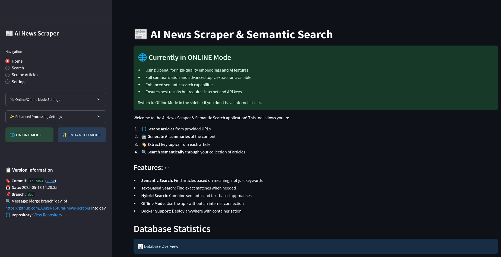
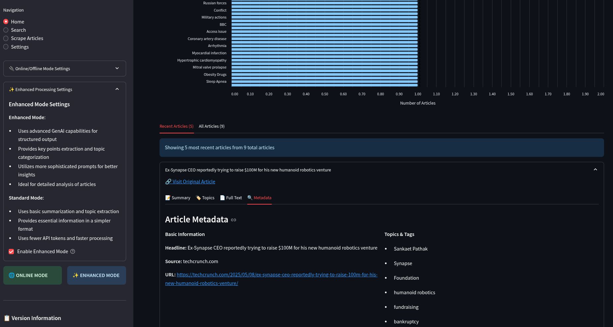
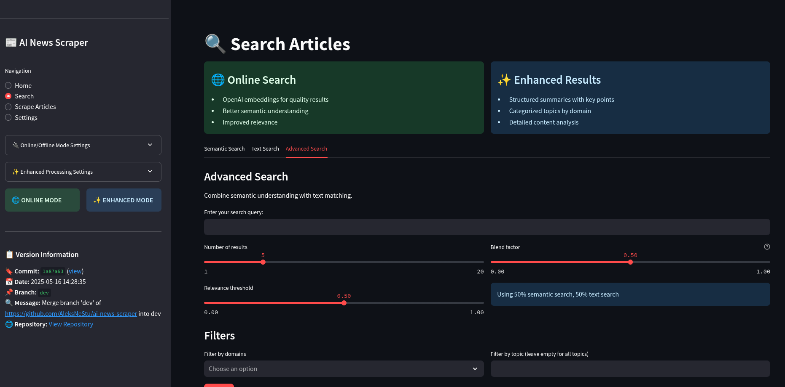
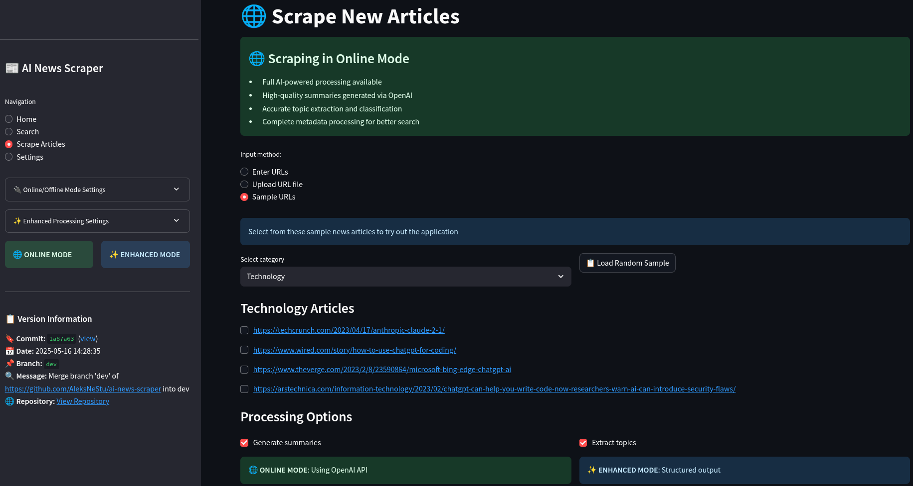
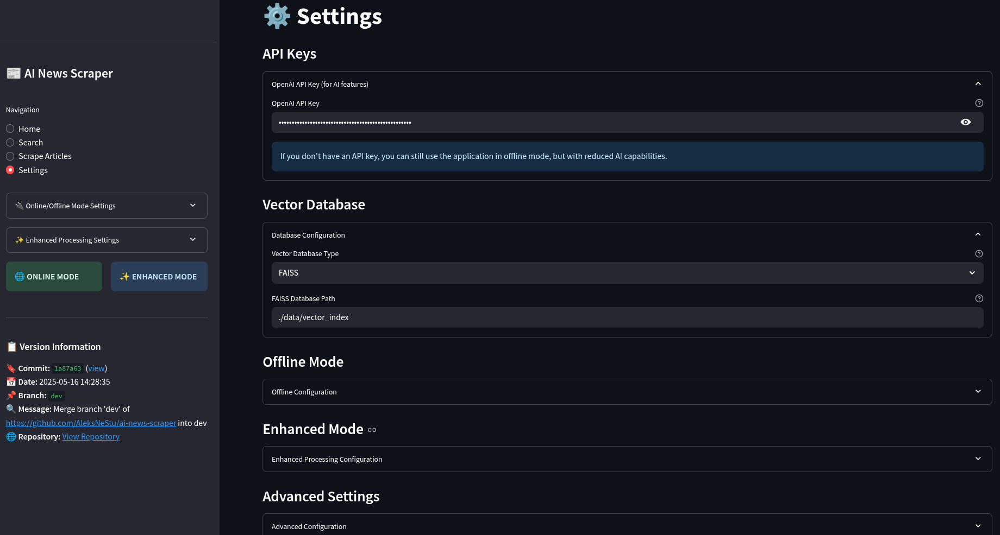

# **AI News Scraper & Semantic Search with GenAI - Comprehensive PRD**

## 📋 Table of Contents
1. [Project Overview](#project-overview)
2. [Test Assignment Context](#test-assignment-context) 
3. [Functional Requirements](#functional-requirements)
4. [Technical Requirements](#technical-requirements)
5. [Current Issues & Task Tracking](#current-issues--task-tracking)
6. [CI/CD Implementation](#cicd-implementation)
7. [Architecture & Demo](#architecture--demo)
8. [Evaluation Criteria](#evaluation-criteria)

---

## 📽️ Project Overview

### Demo Preview

*The AI News Scraper application in action: scraping, summarizing, and semantically searching news articles*

### Objective
This project demonstrates **problem-solving skills** and ability to quickly learn and apply **Generative AI (GenAI)** technologies. The solution extracts news articles from provided URLs, generates summaries and identifies topics using GenAI tools, and implements semantic search capabilities.

### Core Features
- **Scrapes** full news articles (headline + body) from provided URLs using newspaper3k and BeautifulSoup4
- Uses **GenAI** (OpenAI GPT models) to:
  - Generate concise article summaries (100-300 words)
  - Extract relevant topics and keywords with hierarchical categorization
- **Stores** content and metadata in a **vector database** (FAISS/Qdrant/Pinecone)
- Implements **semantic search** with hybrid capabilities for intelligent article retrieval
- Provides **multiple interfaces**: Streamlit UI, CLI, and Python API
- Supports **offline mode** with local models for development or air-gapped environments
- Offers **containerized deployment** for easy setup and scalability

---

## 🎯 Test Assignment Context

### Task Description

#### 1️⃣ News Extraction
- Develop a script to **scrape news articles** from provided URLs
- Ensure the extracted content captures the **full text and headline** of the articles

#### 2️⃣ GenAI-driven Summarization and Topic Identification
- Use a **GenAI platform or tool** (e.g., OpenAI's GPT models, or any other LLM) to analyze the articles
- Generate a **concise summary** that captures key points
- Identify the **main topics** of each article
- Focus on **effectively integrating and utilizing GenAI tools** rather than building from scratch

#### 3️⃣ Semantic Search with GenAI
- Store the extracted news, their GenAI-generated summaries, and topics in a **vector database**
- Implement a **semantic search feature** leveraging GenAI tools to interpret and find relevant articles based on user queries
- This search should **understand the context** of the queries and match them effectively with the summaries and topics
- Search should handle **semantically close search terms** like synonyms

### Requirements
- Implement the solution using **Python**. Relevant libraries might include Langchain, LlamaIndex, Semantic Kernel, or others
- The solution should be **clean, well-structured, and properly documented**
- Provide a **GitHub repository** link containing all source code and a readme file with instructions on setting up and running your prototype

---

## 📋 Functional Requirements

The following table outlines the detailed functional requirements of the News Scraper & Semantic Search application.

| Requirement ID | Description                                      | User Story                                                                                                           | Expected Behavior/Outcome                                                                                                                                         |
|----------------|--------------------------------------------------|----------------------------------------------------------------------------------------------------------------------|-------------------------------------------------------------------------------------------------------------------------------------------------------------------|
| FR001          | Extracting News Articles                        | As a user, I want the system to fetch full news articles from provided URLs so that I can process and store them.   | The system should scrape the article's headline and full text and return structured data for each URL provided. Implement robust error handling with retries, logging, and skip invalid URLs.                                                   |
| FR002          | Summarizing News Articles                       | As a user, I want the system to summarize the articles so I can quickly understand the key points of each one.      | The system should use a GenAI model to generate concise, informative summaries (100-300 words) for each scraped article.                                                          |
| FR003          | Identifying Topics in Articles                  | As a user, I want the system to identify main topics of each article so I can categorize and search them effectively.| The system should extract and list key topics or keywords (3-10 per article) relevant to each article using a GenAI tool. Topics should come from predefined categories for consistency.                                                           |
| FR004          | Storing Data in a Vector Database               | As a developer, I want to store articles, summaries, and topics in a vector DB to enable fast semantic search.      | The system should generate embeddings (using models like text-embedding-ada-002) and save them along with metadata (URL, headline, summary, topics) in a vector database (e.g., FAISS, Pinecone, Qdrant).    |
| FR005          | Semantic Search Feature                         | As a user, I want to search articles semantically using natural language queries so I can find relevant content.     | The system should convert user queries to embeddings, perform similarity searches in the vector DB, and return the top relevant articles ranked by similarity.                         |
| FR006          | Handling Synonyms and Context in Search         | As a user, I want the search to understand synonyms and context so that I get meaningful results.                   | The semantic search should match conceptually similar queries and article content (e.g., "AI" and "Artificial Intelligence" are treated as the same topic).       |
| FR007          | Robust Error Handling for Scraping              | As a developer, I want the system to handle scraping errors gracefully so that the pipeline is stable.              | The system should implement retries, log errors, and skip invalid or unreachable URLs while continuing processing. When partial data is available, it should still store articles with appropriate fallback values for missing fields.                                                 |
| FR008          | API Key Management and Security                 | As a developer, I want to manage API keys securely so the system is safe from unauthorized use.                     | The system should load API keys from environment variables and ensure they are not hardcoded or exposed in logs.                                                   |
| FR009          | Local Development Setup                         | As a developer, I want clear setup instructions so I can run the app locally.                                       | The repository should include a `README.MD` detailing environment setup, dependencies, and how to run the full pipeline end-to-end.                               |
| FR010          | Testing                                         | As a developer, I want to test the system's modules to ensure each component works as expected.                     | The project should include unit tests and integration tests covering scraping, summarization, topic extraction, and semantic search modules.                      |
| FR011          | Python 3.12 Compatibility                       | As a developer, I want the application to use Python 3.12 so it leverages the latest language features.            | All code should be compatible with Python 3.12 and take advantage of its features where appropriate.                                                              |
| FR012          | Poetry Dependency Management                    | As a developer, I want to use Poetry for dependency management so the project has reproducible builds.              | The project should use Poetry for dependency management, with a complete `pyproject.toml` file defining all dependencies and development requirements.            |
| FR013          | Offline Mode Support                           | As a user, I want to use the system without internet connectivity after initial setup so that I can work offline.    | The system should provide an offline mode that uses local models and cached data when internet connectivity is unavailable.                                      |
| FR014          | Text-based Matching                           | As a user, I want to complement semantic search with text-based matching so I can find exact phrases when needed.     | The system should allow hybrid searches combining semantic similarity and exact text matching for more precise results when required.                           |
| FR015          | Docker Containerization                        | As a developer, I want the application containerized so it can be easily deployed in various environments.           | The system should include a Dockerfile and docker-compose configuration for easy setup and deployment with all dependencies managed within the container.       |
| FR016          | Interactive Web UI                             | As a user, I want a web interface to interact with the system so I can use it without command line knowledge.        | The system should provide a Streamlit-based web interface for uploading URLs, viewing article summaries, and performing semantic searches with visualizations. |
| FR017          | Data Quality & Fallbacks                       | As a user, I want a consistent experience even when scraping encounters partial failures.                         | The system should provide appropriate fallbacks and default values for missing data (topics, summary, content), ensuring a consistent experience in the UI. |
| FR018          | Topic Normalization                           | As a user, I want consistent topic categorization across articles for better organization and searching.             | The system should map extracted topics to a predefined set of categories, ensuring consistency in topic naming and hierarchy. |

## ⚙️ Technical Requirements

| Requirement ID | Description                                       | Details                                                                                                                |
|----------------|---------------------------------------------------|------------------------------------------------------------------------------------------------------------------------|
| TR001          | Programming Language                              | Python 3.12+                                                                                                           |
| TR002          | Package Management                                | Poetry for dependency management and virtual environments                                                              |
| TR003          | Web Scraping Libraries                            | newspaper3k and/or BeautifulSoup for article extraction                                                                |
| TR004          | GenAI Integration                                 | OpenAI GPT models or equivalent for summarization and topic extraction                                                 |
| TR005          | Vector Database                                   | FAISS, Pinecone, or Qdrant for storing and searching embeddings                                                        |
| TR006          | Embedding Models                                  | OpenAI embedding models (e.g., text-embedding-ada-002) or equivalent                                                   |
| TR007          | Testing Framework                                 | pytest for unit and integration testing                                                                                |
| TR008          | Configuration Management                          | Environment variables via python-dotenv for sensitive data                                                             |
| TR009          | Code Quality                                      | Adherence to PEP8, use of type hints, comprehensive docstrings                                                         |
| TR010          | Error Handling                                    | Robust exception handling, graceful degradation, and meaningful error messages                                          |
| TR011          | Docker Containerization                           | Docker container configuration for easy deployment and environment isolation                                           |
| TR012          | UI Framework                                      | Streamlit for creating an interactive web interface                                                                    |

---

## 🐛 Current Issues & Task Tracking

### Priority Levels & Current Status

#### P0 - Critical Issues
*None currently identified*

#### P1 - High Priority Issues
- **P1.1** `View full text` functionality not working in UI
- **P1.2** ModuleNotFoundError in deployed version (sample_urls import issue) ✅ **RESOLVED**

#### P2 - Medium Priority Issues
- **P2.1** Improve error handling for edge cases
- **P2.2** Optimize performance for large article volumes
- **P2.3** Enhance offline mode capabilities

#### P4 - Nice to Have Features
- **P4.1** Add vector index viewer for FAISS (OR colab, jupyter, streamlit)
- **P4.2** Implement advanced analytics dashboard
- **P4.3** Add support for additional languages
- **P4.4** Create interactive data visualization components

### Task Management with TaskMaster
*Note: TaskMaster integration requires API key configuration for automatic task generation. Tasks can be manually tracked using the priority system above.*

---

## 🚀 CI/CD Implementation

### Pipeline Overview
The project implements CI/CD pipelines for both GitLab and Azure DevOps with the following stages:

```
┌───────────┐     ┌───────────┐     ┌───────────┐     ┌───────────┐     ┌───────────┐
│   Code    │────▶│   Lint    │────▶│   Test    │────▶│   Build   │────▶│  Deploy   │
│  Commit   │     │           │     │           │     │           │     │           │
└───────────┘     └───────────┘     └───────────┘     └───────────┘     └───────────┘
```

### Key Pipeline Features
- **Python Dependency Management**: Using Poetry
- **Code Quality**: Flake8, MyPy, Black, pytest
- **Test Coverage**: Coverage reports with minimum thresholds
- **Docker Integration**: Build and push to registry
- **Environment Management**: Development, Staging, Production
- **Security**: Secret management and authentication

### GitLab CI/CD Implementation
Creates `.gitlab-ci.yml` with stages:
1. **Lint**: Code quality checks using flake8, mypy, and black
2. **Test**: Runs pytest with coverage reporting
3. **Build**: Creates and pushes Docker image to GitLab Container Registry
4. **Deploy**: Handles deployments to staging and production environments

### Azure DevOps Implementation
Uses `azure-pipelines.yml` with stages:
1. **Validate**: Includes both linting and testing
2. **Build**: Creates and pushes Docker image to Azure Container Registry
3. **DeployToStaging**: Deploys to staging environment on commits to main branch
4. **DeployToProduction**: Deploys to production environment on tagged releases

### Environment Configuration

#### Staging Environment
- Uses FAISS vector database (file-based)
- Configured with basic resources for testing
- Automatically deployed on pushes to main branch

#### Production Environment
- Uses Qdrant vector database (via managed Azure Container Instance)
- Configured with production-grade resources
- Deployed only on tagged releases
- Requires manual approval for deployment

---

## 🏗️ Architecture & Demo

### Demo Showcase

#### Application Interface
<div align="center">
  
  <p><em>Home screen of the AI News Scraper application</em></p>
</div>

#### Article Scraping
<div align="center">
  
  <p><em>Adding and processing news article URLs</em></p>
</div>

#### Semantic Search
<div align="center">
  
  <p><em>Searching for articles using natural language queries</em></p>
</div>

#### Search Results
<div align="center">
  
  <p><em>Viewing semantically relevant search results with summaries and topics</em></p>
</div>

#### System Configuration
<div align="center">
  
  <p><em>Configuring application settings and processing options</em></p>
</div>

### Solution Architecture

#### Visual Overview
<div align="center">
  <table>
    <tr>
      <td width="60%">
        
      </td>
      <td width="40%">
        <h4>Key Components:</h4>
        <ul>
          <li>📥 <strong>Data Ingestion</strong>: URL processing</li>
          <li>🧠 <strong>AI Processing</strong>: Summarization & topic extraction</li>
          <li>💾 <strong>Vector Storage</strong>: Embedding database</li>
          <li>🔍 <strong>Semantic Search</strong>: Natural language queries</li>
          <li>📊 <strong>UI Dashboard</strong>: Interactive interface</li>
        </ul>
      </td>
    </tr>
  </table>
</div>

#### Core Architecture
The AI News Scraper implements a modular, pipeline-based architecture:

```
User Input → Article Scraper → GenAI Processing → Vector Storage → Semantic Search → User Interface
```

**Key Components:**
1. **Data Ingestion Layer**: URL input, error handling, multi-format extraction
2. **GenAI Processing Layer**: OpenAI integration, local model fallbacks, structured analysis
3. **Storage Layer**: Pluggable vector database architecture, metadata management
4. **Search Layer**: Semantic similarity, hybrid search, relevance ranking
5. **Presentation Layer**: Streamlit interface, CLI, programmatic API

---

## 📊 Evaluation Criteria

### ⭐ Assessment Focus Areas
- **Creativeness and efficiency** in using GenAI tools for summarization and topic identification
- **Clarity and quality** of code documentation
- **Overall functionality** and creativity of the solution

### Technical Success Metrics
- Successfully scrape and process 95%+ of provided URLs
- Generate high-quality summaries with user satisfaction > 85%
- Achieve semantic search relevance score > 80%
- Maintain system uptime > 99% during operation
- Complete article processing within 30 seconds per article

### User Experience Metrics
- Intuitive UI with minimal learning curve
- Fast search response times (< 2 seconds)
- Clear error messages and user guidance
- Consistent data presentation across all interfaces

### Development Quality Metrics
- Code coverage > 80%
- All critical and high-priority issues resolved
- Comprehensive documentation and setup instructions
- Successful deployment in containerized environment

---

## 📁 Project Structure

```
src/
  ├── scraper.py      # Article scraping logic
  ├── summarizer.py   # GenAI summarization implementation
  ├── topics.py       # Topic extraction functionality
  ├── embedder.py     # Embedding generation code
  ├── vector_store.py # Vector DB interaction logic
  ├── search.py       # Semantic search implementation
  ├── config.py       # Configuration and settings management
  ├── utils.py        # Utility functions and helpers
  ├── ui/             # Streamlit UI components
  │   ├── app.py      # Main Streamlit application
  │   ├── pages/      # UI pages and components
  │   └── assets/     # UI static assets
  └── main.py         # Pipeline orchestration
tests/                # Unit and integration tests
.taskmaster/          # TaskMaster configuration and docs
  ├── docs/           # Project documentation
  │   └── prd.txt     # Parsed PRD for task generation
  └── tasks/          # Generated task files
demo/                 # Demo materials (images, gifs)
docker-compose.yml    # Multi-container setup
Dockerfile            # Container configuration
azure-pipelines.yml   # Azure DevOps pipeline
.gitlab-ci.yml        # GitLab CI/CD pipeline
```

---

*This comprehensive PRD integrates the original task assignment requirements, functional specifications, current issues tracking, CI/CD implementation details, and architectural documentation into a single coherent document for effective project management and development.*
